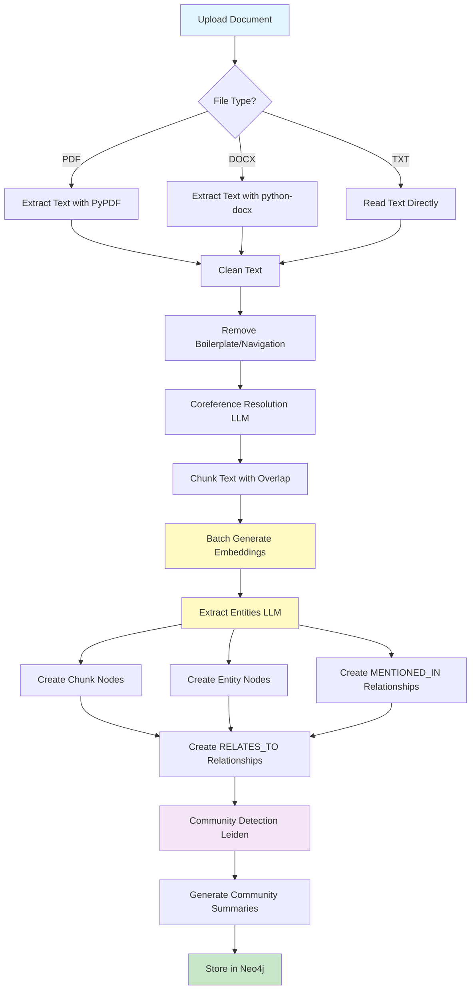
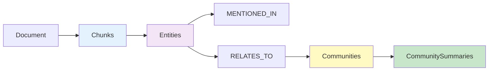
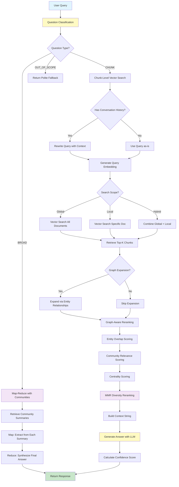
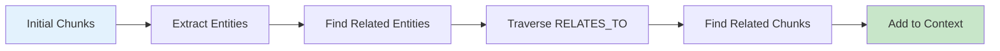

# Graph RAG API - Production Ready Implementation

## Overview

Graph RAG (Graph Retrieval-Augmented Generation) is a production-ready FastAPI application that combines Neo4j graph database with advanced LLM-based NLP processing and vector similarity search. The system processes documents (PDF, DOCX, TXT), builds knowledge graphs, and provides intelligent search capabilities with significant performance optimizations.

### Core Features

- **LLM-based NLP Processing** - Uses configurable LLM models (e.g., Gemini, OpenAI-compatible) for efficient entity extraction and coreference resolution
- **Intelligent Question Classification** - MCP-based routing that classifies questions as BROAD, CHUNK, or OUT_OF_SCOPE for optimal search strategy
- **Map-Reduce for Broad Questions** - Processes community summaries using map-reduce pattern for comprehensive overview answers
- **Batch Embedding Optimization** - 10x speed improvement through intelligent batching and caching
- **Unified Search Pipeline** - Single, flexible endpoint with intelligent routing based on question type
- **Vector Similarity Search** - Native Neo4j vector indexes for fast semantic search
- **Graph-Based Context Expansion** - Entity relationship traversal for comprehensive answers
- **Community Detection** - Leiden algorithm for automatic topic clustering and summarization
- **MMR Reranking** - Maximal Marginal Relevance for diverse, high-quality results
- **Comprehensive Async Handling** - Non-blocking operations throughout the pipeline
- **Production-Ready Architecture** - Centralized configuration, resilience patterns, and structured logging
- **Resilience Patterns** - Circuit breakers and automatic retries for all external service calls
- **Structured Logging** - Consistent, context-rich logging across all modules for better observability

## Table of Contents

- [Overview](#overview)
- [Architecture &amp; Core Logic](#architecture--core-logic)
- [Document Processing Pipeline](#document-processing-pipeline)
- [Search Pipeline](#search-pipeline)
- [Quick Start](#quick-start)
- [Configuration](#configuration)
- [API Endpoints](#api-endpoints)
- [Achievements &amp; Current Status](#achievements--current-status)
- [Future Enhancements](#future-enhancements)
- [Testing](#testing)
- [Performance Optimizations](#performance-optimizations)

---

## Architecture & Core Logic

### System Architecture

```
┌─────────────────────────────────────────────────────────────┐
│                    FastAPI Application                       │
│  ┌──────────────┐  ┌──────────────┐  ┌──────────────┐      │
│  │ Document API │  │  Search API  │  │ System API   │      │
│  └──────┬───────┘  └──────┬───────┘  └──────┬───────┘      │
└─────────┼──────────────────┼──────────────────┼─────────────┘
          │                  │                  │
          │                  │                  │
┌─────────▼──────────────────▼──────────────────▼─────────────┐
│                  Core Processing Layer                       │
│  ┌──────────────┐  ┌──────────────┐  ┌──────────────┐      │
│  │ NLP Processor│  │ Embedding    │  │ LLM Client   │      │
│  │ (LLM-based)  │  │ Client       │  │              │      │
│  └──────────────┘  └──────────────┘  └──────────────┘      │
│  ┌──────────────┐  ┌──────────────┐                        │
│  │ Text         │  │ Graph        │                        │
│  │ Processor    │  │ Manager      │                        │
│  └──────────────┘  └──────────────┘                        │
└─────────┬──────────────────┬───────────────────────────────┘
          │                  │
          │                  │
┌─────────▼──────────────────▼───────────────────────────────┐
│              Neo4j Graph Database                           │
│  ┌──────────────┐  ┌──────────────┐  ┌──────────────┐      │
│  │  Chunks      │  │  Entities    │  │ Communities  │      │
│  │  (with       │  │  (with       │  │  (with       │      │
│  │  vectors)    │  │  vectors)    │  │  summaries)  │      │
│  └──────────────┘  └──────────────┘  └──────────────┘      │
└─────────────────────────────────────────────────────────────┘
```

### Core Components

1. **Main Application** (`main.py`)

   - FastAPI application with lifespan management
   - Structured request logging and error handling middleware
   - Health checks and monitoring endpoints
   - Uses centralized configuration and logging

2. **Configuration Management** (`config.py`)

   - **Centralized configuration module** - Single source of truth for all settings
   - Loads, validates, and documents all configuration from environment variables
   - Type-safe dataclasses for each configuration section
   - Reduces duplication and runtime surprises
   - Provides configuration validation on startup

3. **Resilience Patterns** (`resilience.py`)

   - **Circuit breaker implementation** - Prevents cascading failures (CLOSED/OPEN/HALF_OPEN states)
   - **Automatic retries with exponential backoff** - Handles transient failures gracefully
   - **Timeout handling** - Prevents hanging operations
   - **Per-service circuit breakers** - Separate breakers for LLM, embedding, NER, coref, Neo4j, MCP
   - All external service calls automatically wrapped with resilience patterns

4. **Structured Logging** (`logging_config.py`)

   - **Standardized logging** - Consistent format across all modules
   - **Structured context fields** - Request IDs, operation names, service context
   - **JSON-formatted logs** - Optional for production (enabled via LOG_JSON)
   - **Request tracking** - Context variables for request/operation correlation
   - **Helper functions** - Common logging patterns (function calls, external services, DB operations)

5. **Document Processing** (`document_api.py`)

   - Multi-format file processing (PDF, DOCX, TXT)
   - LLM-based entity extraction (configurable model, e.g., Gemini, OpenAI-compatible)
   - LLM-based coreference resolution
   - Batch embedding generation with caching
   - Graph construction with cross-document entity merging
   - Community detection (Leiden algorithm) and summarization
   - All external calls use resilience patterns and structured logging

6. **Unified Search** (`unified_search.py`)

   - Intelligent question classification and routing
   - Map-reduce processing for broad questions
   - Vector similarity search with native Neo4j indexes
   - Graph-aware context expansion
   - Graph-aware reranking with entity overlap
   - MMR diversity reranking
   - Community summary integration
   - Resilient external service calls with structured logging

7. **Question Classification** (`question_classifier.py`)

   - MCP-based classification (optional)
   - Heuristic-based classification (fast fallback)
   - LLM-based classification (accurate)
   - Routes questions to appropriate search strategies
   - Uses centralized config, resilience, and structured logging

8. **Map-Reduce Processing** (`map_reduce.py`)

   - Map step: Extract relevant info from community summaries
   - Reduce step: Synthesize partial answers into comprehensive response
   - Optimized for broad/overview questions
   - Uses resilience patterns for LLM calls

9. **Utilities** (`utils.py`)

   - LLM-based NLP processing (NER, coreference resolution)
   - Batch embedding client with caching (TTL-based)
   - Advanced text cleaning and chunking
   - Async wrappers for database operations with resilience
   - Support for both OpenAI-compatible and Gemini APIs
   - All external calls protected with circuit breakers and retries

---

## Document Processing Pipeline

The document processing pipeline transforms raw documents into a searchable knowledge graph.

### Processing Flow



### Key Processing Steps

#### 1. Text Extraction & Cleaning

- **PDF Processing**: Uses PyPDF for text extraction from PDF files
- **DOCX Processing**: Uses python-docx for Word document parsing
- **Text Cleaning**: Removes boilerplate, navigation text, headers/footers, URLs
- **Coreference Resolution**: LLM-based resolution using gemma3:1b model

#### 2. Text Chunking

- **Sentence-aware chunking**: Uses BlingFire for sentence boundary detection
- **Overlap management**: Configurable overlap (default 50 chars) to maintain context
- **Size optimization**: Configurable chunk size (default 512 tokens)

#### 3. Entity Extraction

- **LLM-based NER**: Uses configurable LLM model (default: Gemini, configurable via NER_MODEL, NER_BASE_URL)
- **Entity Types**: Supports 18+ entity types (PERSON, ORGANIZATION, LOCATION, etc.)
- **Cross-Document Merging**: Entities with same name are merged across documents
- **Batch Processing**: Processes multiple chunks efficiently

#### 4. Graph Construction



**Graph Schema:**

- **Chunk Nodes**: Store text, embeddings, document metadata
- **Entity Nodes**: Store entity names, types, embeddings
- **MENTIONED_IN**: Relationships between entities and chunks
- **RELATES_TO**: Relationships between co-occurring entities
- **CommunitySummary Nodes**: Store community summaries with embeddings

#### 5. Community Detection

- **Leiden Algorithm**: Uses Neo4j GDS for community detection
- **Fallback Method**: Simple co-occurrence clustering if Leiden fails
- **Automatic Summarization**: LLM-generated summaries for each community

---

## Search Pipeline

The unified search pipeline provides intelligent, context-aware answers by combining question classification, intelligent routing, vector search, graph traversal, and advanced reranking.

### Search Flow



### Search Components

#### 1. Question Classification

The system uses intelligent question classification to route queries to the optimal search strategy:

- **MCP-based Classification** (if enabled): Uses Model Context Protocol server for consistent, accurate classification
- **Heuristic Classification**: Fast keyword-based fallback
- **LLM Classification**: Direct LLM-based classification for accuracy

**Question Types:**

- **BROAD**: Questions requiring overview/understanding → Uses map-reduce with community summaries
- **CHUNK**: Questions requiring specific details → Uses chunk-level vector similarity search
- **OUT_OF_SCOPE**: Questions not answerable from knowledge base → Returns polite fallback

#### 2. Map-Reduce for Broad Questions

For BROAD questions, the system uses a map-reduce pattern:

- **Map Step**: Extract relevant information from each community summary
- **Reduce Step**: Synthesize partial answers into a comprehensive final answer

#### 3. Query Preprocessing

```python
# Query rewriting with conversation history
if conversation_history:
    rewritten_query = llm.rewrite(query, conversation_history)
else:
    rewritten_query = query
```

#### 4. Vector Similarity Search

- **Native Neo4j Vector Index**: Uses `db.index.vector.queryNodes()` for fast search
- **Fallback to GDS**: Uses `gds.similarity.cosine()` if vector indexes unavailable
- **Threshold Filtering**: Configurable similarity threshold (default 0.4)

#### 5. Graph-Based Context Expansion



#### 6. Advanced Reranking

**Graph-Aware Reranking:**

- **Entity Overlap Score**: Measures overlap between query entities and chunk entities
- **Community Relevance**: Similarity to relevant community summaries
- **Centrality Score**: Graph centrality of chunks (degree centrality)

**MMR Reranking:**

- **Maximal Marginal Relevance**: Balances relevance and diversity
- **Formula**: `MMR(doc) = λ × relevance(doc, query) - (1-λ) × max_sim(doc, selected)`
- **Lambda Parameter**: Default 0.7 (favors relevance over diversity)

#### 7. Answer Generation

- **Context Building**: Combines community summaries and relevant chunks
- **LLM Prompting**: Structured prompts with context and conversation history
- **Confidence Scoring**: Based on chunk similarity, summary availability, and quality

---

## Quick Start

### Prerequisites

#### For Docker Compose Setup:
- **Docker** and **Docker Compose**
- **LLM Service**: Gemini API, OpenAI API, or compatible API (for NER and LLM)
- **Embedding Service**: Gemini, OpenAI, or compatible embedding API

#### For Local Development:
- **Python 3.11+**
- **Neo4j 5.0+** with GDS and APOC plugins (or use Docker for Neo4j)
- **LLM Service**: Gemini API, OpenAI API, or compatible API (for NER and LLM)
- **Embedding Service**: Gemini, OpenAI, or compatible embedding API

### Installation

#### Option 1: Docker Compose (Recommended)

The easiest way to run Graph RAG is using Docker Compose, which sets up all services (Neo4j, MCP Classifier, and Graph RAG API) automatically:

```bash
# 1. Clone the repository
git clone <repository-url>
cd graph-rag

# 2. Configure environment variables
cp .env.example .env
# Edit .env with your settings (API keys, model configurations, etc.)

# 3. Start all services
docker-compose up -d

# 4. Check service status
docker-compose ps

# 5. View logs (optional)
docker-compose logs -f graph-rag
```

The API will be available at `http://localhost:8000` with interactive documentation at `/docs`.

**Services:**
- **Graph RAG API**: http://localhost:8000
- **MCP Classifier Server**: http://localhost:8001
- **Neo4j Browser**: http://localhost:7474

#### Option 2: Local Development

For local development without Docker:

```bash
# 1. Clone the repository
git clone <repository-url>
cd graph-rag

# 2. Create virtual environment
python -m venv venv
source venv/bin/activate  # On Windows: venv\Scripts\activate

# 3. Install dependencies
pip install -r requirements.txt

# 4. Start Neo4j with Docker (if not running locally)
docker-compose up -d neo4j

# 5. Optionally start MCP classifier server
docker-compose up -d mcp-classifier

# 6. Configure environment variables
cp .env.example .env
# Edit .env with your settings

# 7. Run the application
python main.py
```

**Note**: For local development, update `DB_URL` in `.env` to `bolt://localhost:7687` instead of `bolt://neo4j:7687`.

---

## Configuration

### Centralized Configuration

All configuration is managed through the `config.py` module, which:
- Loads settings from environment variables with sensible defaults
- Validates configuration on startup
- Provides type-safe access to all settings
- Documents expected settings and their purposes

This eliminates configuration duplication and ensures consistent settings across all modules.

### Environment Variables

#### Application Settings

```bash
APP_TITLE="Graph RAG API"
APP_DESCRIPTION="Production-ready Graph RAG API"
APP_VERSION="2.0.0"
APP_HOST="0.0.0.0"
APP_PORT="8000"
ENABLE_CORS="true"
LOG_LEVEL="INFO"
LOG_JSON="false"  # Set to "true" for JSON-formatted logs in production
```

#### Database Configuration

**For Docker Compose setup:**
```bash
DB_URL="bolt://neo4j:7687"  # Use service name 'neo4j' when running in Docker
DB_USERNAME="neo4j"
DB_PASSWORD="neo4j123"
GRAPH_NAME="entityGraph"
```

**For local development (Neo4j running locally or via Docker):**
```bash
DB_URL="bolt://localhost:7687"  # Use 'localhost' when running locally
DB_USERNAME="neo4j"
DB_PASSWORD="neo4j123"
GRAPH_NAME="entityGraph"
```

**Note**: When using Docker Compose, the `DB_URL` in `.env` is automatically overridden to use the service name. For local development, ensure Neo4j is accessible at `localhost:7687`.

#### LLM Configuration

```bash
# Main LLM for answer generation
LLM_PROVIDER="google"  # or "openai"
OPENAI_API_KEY="your-api-key"
OPENAI_MODEL="gemini-2.5-flash"  # or "llama3.2", etc.
OPENAI_BASE_URL="https://generativelanguage.googleapis.com/v1beta"  # or "http://localhost:11434/v1" for Ollama
OPENAI_TEMPERATURE="0.0"

# NER Model
NER_MODEL="gemini-2.5-flash"  # or your preferred model
NER_BASE_URL="https://generativelanguage.googleapis.com/v1beta"  # or OpenAI-compatible URL
NER_API_KEY="your-api-key"
NER_TEMPERATURE="0.0"

# Coreference Resolution Model
COREF_MODEL="gemini-2.5-flash"  # or your preferred model
COREF_BASE_URL="https://generativelanguage.googleapis.com/v1beta"  # or OpenAI-compatible URL
COREF_API_KEY="your-api-key"
COREF_TEMPERATURE="0.0"
```

#### Embedding Configuration

```bash
# Embedding API URL (format depends on provider)
# Gemini: Base URL without /embeddings (e.g., https://generativelanguage.googleapis.com/v1beta)
# OpenAI/Ollama: Include /embeddings (e.g., http://localhost:11434/v1/embeddings)
EMBEDDING_API_URL="https://generativelanguage.googleapis.com/v1beta"
EMBEDDING_MODEL_NAME="gemini-embedding-001"  # or "mxbai-embed-large", "text-embedding-ada-002", etc.
EMBEDDING_API_KEY="your-api-key"
EMBEDDING_DIMENSION="768"  # Must match your embedding model dimension
EMBEDDING_BATCH_SIZE="10"
```

#### Question Classifier Configuration

```bash
# Enable heuristic-based classification (keyword matching)
CLASSIFIER_USE_HEURISTICS="true"

# Enable LLM-based classification (more accurate)
CLASSIFIER_USE_LLM="true"

# Use MCP (Model Context Protocol) classifier server
USE_MCP_CLASSIFIER="true"

# MCP Classifier Server URL
MCP_CLASSIFIER_URL="http://localhost:8001/mcp"
MCP_CLASSIFIER_PORT="8001"
MCP_CLASSIFIER_TIMEOUT="30"
```

#### Map-Reduce Configuration

```bash
# Maximum communities to process in map-reduce
MAP_REDUCE_MAX_COMMUNITIES="50"
MAP_REDUCE_BATCH_SIZE="5"
MAP_REDUCE_MIN_RELEVANCE="0.3"
```

#### Resilience Configuration

```bash
# Retry Configuration
RESILIENCE_MAX_RETRIES="3"  # Maximum number of retry attempts
RESILIENCE_BACKOFF_FACTOR="2.0"  # Exponential backoff multiplier
RESILIENCE_INITIAL_DELAY="1.0"  # Initial delay in seconds before first retry

# Circuit Breaker Configuration
RESILIENCE_CB_FAILURE_THRESHOLD="5"  # Failures before circuit opens
RESILIENCE_CB_SUCCESS_THRESHOLD="2"  # Successes needed to close circuit
RESILIENCE_CB_TIMEOUT="60.0"  # Seconds before circuit transitions from OPEN to HALF_OPEN

# Request Timeout
RESILIENCE_REQUEST_TIMEOUT="30.0"  # Timeout in seconds for individual requests
```

**Resilience Patterns:**
- All external service calls (LLM, embeddings, Neo4j) automatically use circuit breakers and retries
- Circuit breakers prevent cascading failures by stopping requests to failing services
- Automatic retries handle transient failures with exponential backoff
- Separate circuit breakers per service (llm, embedding, ner, coref, neo4j, mcp_classifier)

#### Performance Tuning

```bash
# Text Processing
CHUNK_SIZE_GDS="512"
CHUNK_OVERLAP="50"
DOCUMENT_PROCESSING_BATCH_SIZE="20"

# Search Parameters
RELEVANCE_THRESHOLD="0.40"
MAX_CHUNKS_PER_ANSWER="7"
QUICK_SEARCH_MAX_CHUNKS="5"
MAX_COMMUNITY_SUMMARIES="3"
SIMILARITY_THRESHOLD_CHUNKS="0.4"
SIMILARITY_THRESHOLD_ENTITIES="0.6"
BROAD_SEARCH_MAX_COMMUNITIES="20"

# Caching
CACHE_TTL="3600"  # 1 hour
BATCH_SIZE="10"
MAX_WORKERS="4"
```

#### Logging Configuration

```bash
# Log Level
LOG_LEVEL="INFO"  # DEBUG, INFO, WARNING, ERROR, CRITICAL

# Structured Logging
LOG_JSON="false"  # Set to "true" for JSON-formatted logs (recommended for production)
LOG_TO_FILE="false"  # Set to "true" to write logs to file
```

**Structured Logging Features:**
- Consistent log format across all modules
- Context fields automatically included (request_id, operation, service, etc.)
- JSON formatting available for production log aggregation
- Request tracking for correlation across services

---

## API Endpoints

### Document Management

#### Upload Documents

```http
POST /api/documents/upload_documents
Content-Type: multipart/form-data

files: [file1.pdf, file2.docx, ...]
```

**Response:**

```json
{
  "message": "Successfully processed 2 documents",
  "results": [
    {
      "doc_id": "uuid-here",
      "document_name": "file1.pdf",
      "chunks_created": 45,
      "entities_extracted": 123,
      "processing_time": 12.34
    }
  ]
}
```

#### List Documents

```http
GET /api/documents/documents
```

#### Delete Document

```http
DELETE /api/documents/delete_document
Content-Type: application/json

{
  "doc_id": "uuid-here"
}
```

#### Get Community Summaries

```http
GET /api/documents/community_summaries?doc_id=uuid-here
```

#### Document Statistics

```http
GET /api/documents/document_stats
```

### Search Endpoints

#### Unified Search

```http
POST /api/search/search
Content-Type: application/json

{
  "question": "What are the main topics?",
  "conversation_history": "Previous context...",
  "doc_id": "optional-doc-id",
  "scope": "hybrid",  // "global" | "local" | "hybrid"
  "max_chunks": 7
}
```

**Note**: This endpoint automatically classifies questions using MCP (if enabled) or heuristic/LLM-based classification, then routes to:

- **BROAD questions**: Map-reduce processing with community summaries
- **CHUNK questions**: Chunk-level vector similarity search
- **OUT_OF_SCOPE questions**: Polite fallback response

**Response:**

```json
{
  "answer": "Detailed answer based on context...",
  "confidence_score": 0.85,
  "chunks_used": 7,
  "entities_found": ["Entity1", "Entity2"],
  "search_time": 1.23,
  "metadata": {
    "scope": "hybrid",
    "community_summaries_used": 2,
    "chunks_retrieved": 14
  }
}
```

#### Quick Search

```http
POST /api/search/quick_search
Content-Type: application/json

{
  "question": "Quick question",
  "doc_id": "optional-doc-id"
}
```

#### Search Suggestions

```http
GET /api/search/search_suggestions?doc_id=optional-doc-id
```

#### Search Analytics

```http
GET /api/search/search_analytics
```

#### Explain Search

```http
POST /api/search/explain_search
Content-Type: application/json

{
  "question": "Your question",
  "scope": "hybrid"
}
```

### System Endpoints

#### Health Check

```http
GET /health
```

#### API Information

```http
GET /api/info
```

#### Interactive Documentation

```http
GET /docs  # Swagger UI
GET /redoc  # ReDoc
```

---

## Achievements & Current Status

### ✅ Completed Features

#### Core Functionality

- ✅ **Multi-format Document Processing** - PDF, DOCX, TXT support
- ✅ **LLM-based Entity Extraction** - Using configurable models (Gemini, OpenAI-compatible)
- ✅ **Coreference Resolution** - LLM-based pronoun resolution
- ✅ **Cross-Document Entity Merging** - Entities with same name merged across documents
- ✅ **Advanced Text Cleaning** - Boilerplate and navigation text removal
- ✅ **Intelligent Chunking** - Sentence-aware with overlap
- ✅ **Batch Embedding Generation** - With TTL-based caching
- ✅ **Neo4j Graph Storage** - Complete graph schema implementation
- ✅ **Vector Indexing** - Native Neo4j vector indexes for fast search

#### Search Capabilities

- ✅ **Intelligent Question Classification** - MCP-based or heuristic/LLM routing
- ✅ **Map-Reduce for Broad Questions** - Comprehensive processing of community summaries
- ✅ **Unified Search Pipeline** - Single endpoint with intelligent routing
- ✅ **Vector Similarity Search** - Native Neo4j and GDS fallback
- ✅ **Graph-Based Expansion** - Entity relationship traversal
- ✅ **Graph-Aware Reranking** - Entity overlap, community, centrality scoring
- ✅ **MMR Diversity Reranking** - Balanced relevance and diversity
- ✅ **Community Summary Integration** - Automatic topic summaries
- ✅ **Conversation History Support** - Context-aware query rewriting

#### Community Detection

- ✅ **Leiden Algorithm** - Neo4j GDS community detection
- ✅ **Fallback Clustering** - Simple co-occurrence method
- ✅ **Automatic Summarization** - LLM-generated community summaries

#### Production Features

- ✅ **Centralized Configuration** - Single source of truth (`config.py`) with validation
- ✅ **Resilience Patterns** - Circuit breakers and automatic retries for all external services
- ✅ **Structured Logging** - Consistent, context-rich logging across all modules (`logging_config.py`)
- ✅ **Comprehensive Error Handling** - Graceful degradation with proper error context
- ✅ **Async Processing** - Non-blocking operations throughout
- ✅ **Request Logging** - Detailed structured logging for monitoring and debugging
- ✅ **Health Checks** - System and component status
- ✅ **Type Safety** - Full type hints throughout
- ✅ **Modular Architecture** - Clean separation of concerns

#### Performance Optimizations

- ✅ **Batch Processing** - Embeddings, entities, queries
- ✅ **Intelligent Caching** - TTL-based embedding cache
- ✅ **Vector Indexes** - Fast similarity search
- ✅ **Connection Pooling** - Efficient database connections
- ✅ **Thread Pool Management** - CPU-bound task optimization

### 🔄 In Progress / Partial

- 🔄 **Streaming Responses** - Basic structure exists, needs enhancement
- 🔄 **Multi-language Support** - Framework ready, needs language-specific models
- 🔄 **Advanced Analytics** - Basic analytics exist, needs expansion

## Future Enhancements

### High Priority

1. **Security & Authentication**

   - JWT-based authentication
   - Role-based access control (RBAC)
   - API key management
   - Rate limiting per user/API key
2. **Scalability Improvements**

   - Redis for distributed caching
   - Vector database integration (Faiss/Pinecone)
   - Horizontal scaling support
   - Database sharding strategies
3. **Enhanced Search**

   - Hybrid search (keyword + vector)
   - Query expansion techniques
   - Faceted search
   - Search result caching
4. **Performance Monitoring**

   - APM integration (e.g., Prometheus)
   - Detailed performance metrics
   - Query performance analysis
   - Resource usage tracking

### Medium Priority

5. **Advanced Features**

   - Multi-language support expansion
   - Custom entity types and models
   - Graph visualization API
   - Document versioning
6. **Developer Experience**

   - SDK/Client libraries
   - Comprehensive tutorials
   - Example applications
   - Migration tools
7. **Data Management**

   - Graph backup/restore
   - Incremental updates
   - Document versioning
   - Bulk import/export

### Low Priority

8. **UI/UX**

   - Web interface for document upload
   - Interactive graph visualization
   - Search interface demo
   - Admin dashboard
9. **Integration**

   - Slack/Teams bots
   - REST API SDKs
   - Webhook support
   - Third-party integrations

---

## Testing

### Running Tests

```bash
# Install test dependencies
pip install pytest pytest-asyncio pytest-cov

# Run all tests
pytest -v

# Run with coverage
pytest --cov=. --cov-report=html

# Run specific test categories
pytest test_system.py::TestEfficientNLPProcessor -v
pytest test_system.py::TestUnifiedSearchPipeline -v
```

### Test Coverage

- ✅ **NLP Processing** - Entity extraction, coreference resolution
- ✅ **Embedding Operations** - Batch processing, caching
- ✅ **Search Pipeline** - Vector search, reranking, answer generation
- ✅ **Database Operations** - Neo4j connectivity, queries
- ✅ **Error Handling** - Edge cases, invalid inputs
- ✅ **Performance** - Batch vs individual processing
- ✅ **Question Classification** - Accuracy testing for BROAD/CHUNK/OUT_OF_SCOPE classification
- ✅ **Map-Reduce Processing** - Aggregation accuracy and partial failure handling
- ✅ **Classification Routing** - Integration tests for question classification and routing

---

## Performance Optimizations

### Implemented Optimizations

| Optimization                    | Impact             | Implementation                           |
| ------------------------------- | ------------------ | ---------------------------------------- |
| **Batch Embedding**       | 10x faster         | Batch API calls with caching             |
| **Vector Indexes**        | 100x faster search | Native Neo4j vector indexes              |
| **LLM-based NER**         | Flexible           | Configurable (Gemini, OpenAI-compatible) |
| **Async Operations**      | Non-blocking       | Full async/await pipeline                |
| **Intelligent Caching**   | Reduced API calls  | TTL-based embedding cache                |
| **Graph-Aware Reranking** | Better relevance   | Entity overlap + community scoring       |
| **MMR Reranking**         | Better diversity   | Maximal Marginal Relevance               |

### Performance Metrics

- **Document Processing**: ~0.5-2 seconds per document (depending on size)
- **Entity Extraction**: ~0.1-0.5 seconds per chunk (LLM-based, model dependent)
- **Search Response Time**: 1-3 seconds average (varies by question type and classification method)
- **Embedding Generation**: Batch of 10 in ~0.5 seconds (cached)
- **Question Classification**: < 0.5 seconds (MCP or heuristic), 1-2 seconds (direct LLM)

---

## Additional Resources

### Project Structure

```
graph-rag/
├── main.py                 # FastAPI application entry point
├── config.py               # Centralized configuration module
├── resilience.py           # Resilience patterns (circuit breakers, retries)
├── logging_config.py       # Standardized structured logging
├── document_api.py         # Document processing endpoints
├── search_api.py           # Search endpoints
├── unified_search.py       # Core search pipeline logic with classification routing
├── question_classifier.py  # Question classification (MCP, heuristic, LLM)
├── map_reduce.py           # Map-reduce processing for broad questions
├── mcp_classifier_client.py # MCP classifier client
├── mcp_classifier_server.py # MCP classifier server
├── utils.py                # NLP, embeddings, utilities
├── test_system.py          # Comprehensive test suite
├── requirements.txt        # Python dependencies
├── docker-compose.yaml     # Docker Compose configuration for all services
├── Dockerfile              # Main Graph RAG API Dockerfile
├── Dockerfile.mcp          # MCP classifier server Dockerfile
├── .env                    # Environment configuration (not in git)
├── .env.example            # Environment configuration template
└── README.md              # This file
```

**New Architecture Components:**
- `config.py`: Centralized configuration loading, validation, and documentation
- `resilience.py`: Circuit breakers and retry logic for external service calls
- `logging_config.py`: Standardized structured logging with context fields

All modules now use these infrastructure components for consistency and reliability.

### Key Dependencies

- **FastAPI** - Modern async web framework
- **Neo4j Driver** - Graph database connectivity
- **HTTPX** - Async HTTP client for LLM and embedding APIs
- **PyPDF** - PDF text extraction
- **python-docx** - Word document parsing
- **BlingFire** - Sentence boundary detection
- **NumPy** - Numerical computations
- **MCP (Model Context Protocol)** - For question classification (optional)

### Documentation

- **API Documentation**: Available at `/docs` (Swagger UI)
- **Alternative Docs**: Available at `/redoc` (ReDoc)
- **Health Check**: `/health` for system status
- **API Info**: `/api/info` for capabilities

---

## Support & Contribution

### Getting Help

- **API Documentation**: Visit `/docs` for interactive API documentation
- **Health Check**: Monitor system status at `/health`
- **Analytics**: View usage statistics at `/api/search/search_analytics`
- **Logs**: Check application logs for debugging

### Development

#### Docker Development

For development with Docker, you can mount the code as a volume for live reloading:

```yaml
# In docker-compose.yaml, add volumes to graph-rag service:
volumes:
  - ./logs:/app/logs
  - .:/app  # Mount code for development
  - /app/__pycache__  # Exclude cache
```

Then set environment variables in `.env`:
```bash
RELOAD=true
LOG_LEVEL=DEBUG
```

#### Local Development

For local development without Docker:

```bash
# Set environment variables
export RELOAD=true
export LOG_LEVEL=DEBUG

# Or create a .env file with:
# RELOAD=true
# LOG_LEVEL=DEBUG

# Run the application
python main.py
```

### Docker Commands

Common Docker Compose commands:

```bash
# Start all services
docker-compose up -d

# Stop all services
docker-compose down

# View logs
docker-compose logs -f graph-rag
docker-compose logs -f neo4j
docker-compose logs -f mcp-classifier

# Rebuild and restart a service
docker-compose up -d --build graph-rag

# Check service status
docker-compose ps

# Execute commands in a container
docker-compose exec graph-rag python -c "from utils import nlp_processor; print('OK')"

# Stop and remove containers, networks, and volumes
docker-compose down -v
```

---

## License

See LICENSE file for details.

---

## Version History

- **v2.1.0** - Production-ready resilience patterns: centralized configuration (`config.py`), circuit breakers and automatic retries (`resilience.py`), structured logging (`logging_config.py`). All external service calls now use resilience patterns to handle transient failures gracefully without user-facing errors.
- **v2.0.0** - Unified search pipeline with intelligent question classification, map-reduce for broad questions, MCP classifier integration, graph-aware reranking, MMR diversity, cross-document entity merging
- **v1.0.0** - Initial release with basic document processing and search

---

## Resilience & Reliability

### Circuit Breakers

The system uses circuit breakers to prevent cascading failures:
- **Per-service breakers**: Separate breakers for LLM, embedding, NER, coreference, Neo4j, and MCP classifier
- **Three states**: CLOSED (normal), OPEN (failing), HALF_OPEN (testing recovery)
- **Automatic recovery**: Circuit automatically transitions back to CLOSED after successful requests
- **Configurable thresholds**: Adjust failure/success thresholds and timeout periods via environment variables

### Automatic Retries

All external service calls include automatic retry logic:
- **Exponential backoff**: Delays increase exponentially between retries (e.g., 1s, 2s, 4s)
- **Configurable attempts**: Default 3 retries, configurable per service
- **Smart retryable errors**: Only retries on transient failures, not permanent errors
- **Timeout protection**: Requests timeout after configured duration to prevent hanging

### Structured Logging

Consistent logging across all modules:
- **Context fields**: Request IDs, operation names, service context automatically included
- **Structured format**: Consistent schema for easy parsing and analysis
- **JSON option**: Can output JSON-formatted logs for production log aggregation (set `LOG_JSON=true`)
- **Error context**: All errors logged with full context for easier debugging in production

### Configuration Management

Centralized configuration provides:
- **Single source of truth**: All settings in `config.py` with validation
- **Type safety**: Type-checked configuration with Pydantic
- **Documentation**: Settings documented with defaults and descriptions
- **Runtime validation**: Configuration validated on startup to catch errors early

---

**Built with ❤️ for intelligent document understanding and retrieval.**
